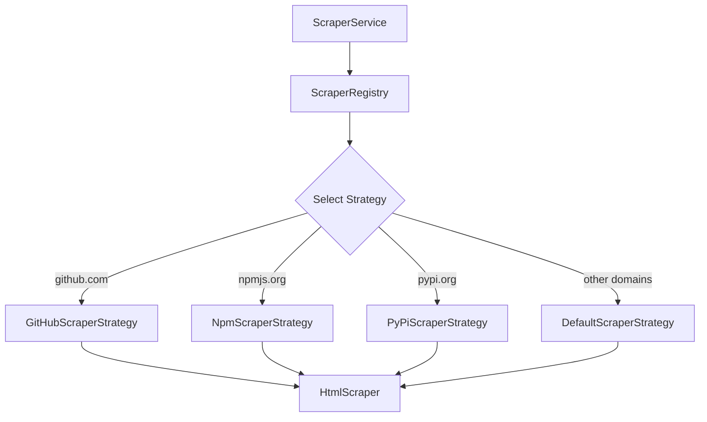
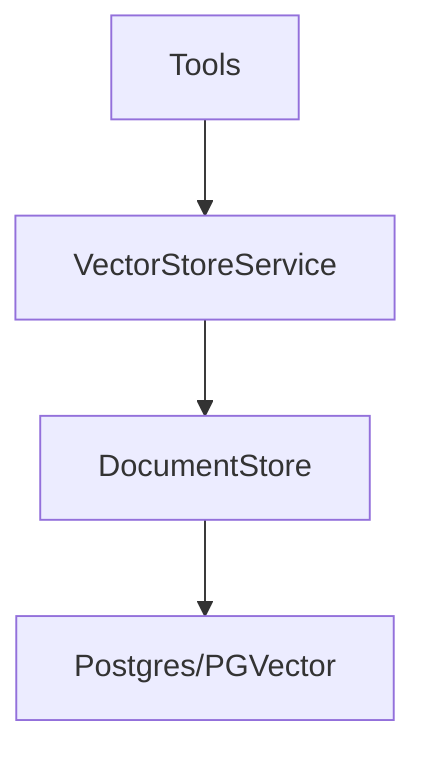

# Documentation MCP Server Architecture

## Overview

The Documentation MCP Server is designed with a modular architecture that ensures feature parity and code reuse between its two main interfaces:

### File Naming and Code Quality Conventions

- Files containing classes use PascalCase (e.g., `DocumentProcessingPipeline.ts`, `VectorStoreService.ts`)
- Other files use kebab-case or regular camelCase (e.g., `index.ts`, `scraper-service.ts`)
- Avoid type casting where possible. Never use `any` type but prefer `unknown` or `never`.

1. Command Line Interface (CLI)
2. Model Context Protocol (MCP) Server

### Testing

- We use `vitest` for testing.

## Core Design Principles

### 1. Shared Tooling

The project maintains a `tools/` directory containing modular implementations of core functionality. This design choice ensures that:

- Both CLI and MCP server use the same underlying business logic
- Features are implemented once and reused across interfaces
- Changes to functionality only need to be made in one place
- Testing is simplified as core logic is isolated from interface concerns

### 2. Tool Structure

Each tool in the `tools/` directory follows a consistent pattern:

```typescript
// Example tool structure (tools/example.ts)
export interface ToolOptions {
  // Input parameters
}

export interface ToolResult {
  // Output structure
}

export const toolFunction = async (
  options: ToolOptions
): Promise<ToolResult> => {
  // Core implementation
};
```

Current tools include:

- `scrape.ts` - Documentation scraping functionality
- `search.ts` - Search capabilities
- `library.ts` - Library version management
- `document.ts` - Document management operations

### 3. Interface-Specific Adapters

#### CLI (cli.ts)

- Uses Commander.js for command-line argument parsing
- Converts command-line arguments to tool options
- Formats tool results for console output
- Handles CLI-specific error reporting

```typescript
// Example CLI usage
program.command("example <arg>").action(async (arg) => {
  const result = await toolFunction({
    // Convert CLI args to tool options
  });
  console.log(formatOutput(result));
});
```

#### MCP Server (index.ts)

- Implements MCP protocol for AI interaction
- Wraps tool functions in MCP tool definitions
- Formats results as MCP responses
- Provides progress feedback through MCP protocol

```typescript
// Example MCP tool registration
server.tool(
  "example_tool",
  {
    // Zod schema for parameters
  },
  async (params) => {
    const result = await toolFunction({
      // Convert MCP params to tool options
    });
    return {
      content: [{ type: "text", text: formatResult(result) }],
    };
  }
);
```

### 4. Progress Reporting

The project uses a unified progress reporting system with typed callbacks for all long-running operations. This design:

- Provides real-time feedback at multiple levels (page, document, storage)
- Ensures consistent progress tracking across components
- Supports different output formats for CLI and MCP interfaces
- Enables parallel processing with individual progress tracking

### 5. Logging Strategy

The project uses a centralized logging system through `utils/logger.ts` that maps to console methods. The logging follows a hierarchical approach:

1. **Tools Layer (Highest)**

   - Primary user-facing operations
   - Final results and overall progress
   - Example: Search queries and result counts

2. **Core Components (Middle)**

   - Unique operational logs
   - Store creation and management
   - Example: Vector store operations

3. **Strategy Layer (Lowest)**
   - Detailed progress (page crawling)
   - Error conditions and retries
   - Example: Individual page scraping status

This hierarchy ensures:

- Clear operation visibility
- No duplicate logging between layers
- Consistent emoji usage for better readability
- Error logging preserved at all levels for debugging

## Benefits

1. **Maintainability**

   - Single source of truth for business logic
   - Clear separation of concerns
   - Easier to test and debug

2. **Feature Parity**

   - Guaranteed same functionality in both interfaces
   - Consistent behavior and error handling

3. **Extensibility**
   - Easy to add new tools
   - Simple to add new interfaces (e.g., REST API) using same tools

## Future Considerations

When adding new functionality:

1. Implement core logic in a new tool under `tools/`
2. Add CLI command in `cli.ts`
3. Add MCP tool in `index.ts`
4. Maintain consistent error handling and progress reporting

## Directory Structure

```
src/
├── tools/           # Shared core functionality
│   ├── scrape.ts
│   ├── search.ts
│   ├── library.ts
│   └── document.ts
├── cli.ts          # CLI interface
├── index.ts        # MCP server interface
├── types/          # Shared type definitions
├── store/          # Vector store implementation
├── scraper/        # Web scraping implementation
└── utils/          # Shared utilities
    └── url.ts      # URL normalization utilities
```

## Scraper Architecture

The scraper module is responsible for extracting content from various documentation sources. It employs a strategy pattern to handle different website structures and content formats.



### Scraper Components

1. **ScraperService**

   - The main entry point for scraping operations.
   - Receives a URL and delegates to the ScraperRegistry to select the appropriate scraping strategy.
   - Handles overall scraping process and error management.

2. **ScraperRegistry**

   - Responsible for selecting the appropriate scraping strategy based on the URL.
   - Maintains a list of available strategies and their associated domains.
   - Returns a default strategy if no specific strategy is found for the given URL.

3. **ScraperStrategy Interface (Implicit)**

   - Defines the contract for all scraper strategies.
   - Each strategy must implement a `scrape` method that takes a URL and returns the scraped content.

4. **HtmlScraper**

   - A general-purpose HTML scraper that uses `scrape-it` to extract content from web pages.
   - Converts HTML content to Markdown using `turndown`.
   - Implements a retry mechanism with exponential backoff to handle temporary network issues.
   - Allows customization of content and link selectors.

5. **Specialized Strategies**

   - **DefaultScraperStrategy**: A base strategy that uses HtmlScraper to scrape generic web pages.
   - **NpmScraperStrategy**: A strategy for scraping npm package documentation.
   - **PyPiScraperStrategy**: A strategy for scraping Python Package Index documentation.
   - **GitHubScraperStrategy**: A strategy for scraping GitHub repository documentation.

### Benefits of Strategy Pattern

1. **Flexibility**

   - New strategies can be easily added to support different documentation sources.
   - Each strategy can be customized to handle the specific structure and content of its target website.

2. **Maintainability**

   - The scraper logic is well-organized and easy to understand.
   - Changes to one strategy do not affect other strategies.

3. **Extensibility**

   - The scraper can be extended to support new documentation sources without modifying existing code.

## Vector Store Architecture

The vector store module uses a layered architecture to manage document storage and retrieval:



### Vector Store Components

1. **DocumentStore**

   - Encapsulates database operations
   - Manages Postgres connection and PGVector store
   - Handles document metadata and versioning
   - Direct interaction with database layer

2. **VectorStoreService**
   - High-level API for document operations
   - Manages document preprocessing (splitting, chunking)
   - Provides version selection logic
   - Library/version-based access control

### Benefits of Layered Design

1. **Separation of Concerns**

   - Database operations isolated in DocumentStore
   - Business logic centralized in VectorStoreService
   - Clean interface for tools layer

2. **Maintainability**

   - Simplified testing through abstraction
   - Centralized database access
   - Consistent document handling

3. **Performance**
   - Efficient document batching
   - Connection pooling at database layer
   - Optimized search operations

### Error Handling & Retry Mechanism

The `HtmlScraper` implements a robust retry mechanism to handle temporary network issues and improve scraping reliability.

1. **Retry Logic**

   - The `scrapePageWithRetry` method attempts to scrape a page multiple times if the initial attempt fails.
   - It uses exponential backoff to increase the delay between retries, reducing the load on the target server.
   - The maximum number of retries and the base delay are configurable.

2. **Error Classification**

   - The scraper distinguishes between different types of errors to determine whether a retry is appropriate.
   - It retries on 4xx errors, which are typically caused by temporary network issues or server overload.
   - It does not retry on other errors, such as 5xx errors, which are typically caused by server-side problems.

3. **Customizable Options**

   - The retry mechanism can be customized by passing a `RetryOptions` object to the `scrapePageWithRetry` method.
   - The `RetryOptions` object allows you to configure the maximum number of retries and the base delay.
