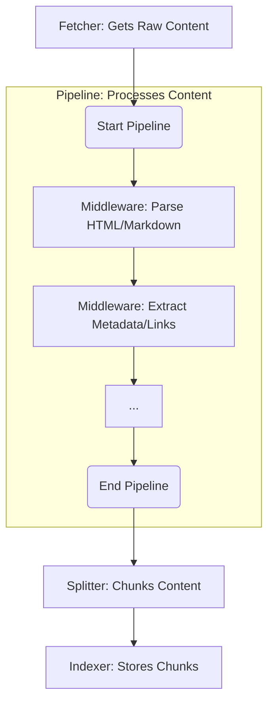

# Documentation MCP Server Architecture

## Overview

The Documentation MCP Server provides a unified system for scraping, storing, and searching documentation. It offers two main interfaces: a Command Line Interface (CLI) and a Model Context Protocol (MCP) Server.

### Key Technologies

The project uses:

- **Build Tool:** Vite
- **Testing:** Vitest
- **Web Interface:** HTMX, AlpineJS
- **Core Logic:** LangChain.js for embedding generation

### Code Conventions

- Class files use `PascalCase` (e.g., `PipelineManager.ts`).
- Other files use `kebab-case` or `camelCase` (e.g., `index.ts`, `scraper-service.ts`).
- Avoid `any` types; prefer `unknown` or specific types.

### Directory Structure

```
src/
├── index.ts                         # Unified CLI, MCP Server, and Web entry point
├── mcp/                             # MCP server implementation details
├── pipeline/                        # Asynchronous job processing pipeline
│   ├── PipelineManager.ts           # Manages job queue, concurrency, state
│   └── PipelineWorker.ts            # Executes a single pipeline job
├── scraper/                         # Web scraping implementation
│   ├── strategies/                  # Scraping strategies for different sources
│   ├── fetcher/                     # Content fetching abstractions
│   ├── middleware/                  # Individual middleware implementations
│   ├── pipelines/                   # HTML and markdown pipelines
│   └── ...
├── splitter/                        # Document splitting and chunking
├── store/                           # Document storage and retrieval
│   ├── DocumentManagementService.ts # Manages document storage and updates
│   ├── DocumentRetrieverService.ts  # Handles document retrieval and context
│   ├── DocumentStore.ts             # Low-level database interactions
│   └── ...
├── tools/                           # Core functionality tools
├── types/                           # Shared type definitions
└── utils/                           # Common utilities and helpers
    ├── config.ts                    # Centralized configuration constants
    ├── logger.ts                    # Centralized logging system
    └── ...
```

## Configuration Management

Default configuration values for the server and its components are defined as constants within `src/utils/config.ts`. This centralizes configuration and simplifies adjustments.

## Core Components Interaction

The system's core functionality revolves around how `scraper`, `fetcher`, `middleware`, `pipeline`, and `splitter` work together to process documentation.

### Scraper, Fetcher, Middleware, and Pipeline

The scraping process is modular and handles various content sources:

- **Content Sources**: Web (HTTP/HTTPS), local filesystem (file://), and package registries (npm, PyPI).

The content processing flow is as follows:

1.  **Fetcher**: Retrieves `RawContent` (raw content, MIME type, charset, URL) from a source.
2.  **Middleware**: `RawContent` is transformed into `MiddlewareContext` and passes through a series of `ContentProcessorMiddleware` components. Each middleware performs a specific task (e.g., parsing HTML, extracting metadata, converting to Markdown).
3.  **Pipeline**: `ContentProcessorMiddleware` components are organized into `ContentPipeline` implementations (e.g., `HtmlPipeline`, `MarkdownPipeline`) based on content type. A `scraper` strategy selects the appropriate pipeline.
4.  **Splitter**: After processing by the pipeline, the content is sent to a `splitter` which breaks it into smaller, manageable chunks for indexing.



## Tools Layer

The `tools/` directory contains modular implementations of core functionality, ensuring features are shared and reused across interfaces (CLI, MCP, Web). Business logic is implemented once, simplifying testing and maintenance.

Common tools include:

- Documentation scraping
- Search capabilities
- Library version management
- Job management (listing, status, cancellation)
- Document management operations
- URL fetching and conversion to Markdown

Both the CLI and MCP server directly use these tools. The Web interface also interacts with these tools to provide its functionality.

## Pipeline Architecture

The document processing is managed by an asynchronous, queue-based system:

- **`PipelineManager`**: Manages a queue of jobs (e.g., scraping tasks), controls concurrency, and tracks job status.
- **`PipelineWorker`**: Executes individual jobs from the queue, orchestrating the scraping and storage of documents.

This separation ensures efficient, scalable processing of documentation.

## Document Storage

The project uses SQLite for document storage. Database schema changes are managed through sequential SQL migrations located in the `db/migrations/` directory.

The database file (`documents.db`) location is determined dynamically: it first checks for a `.store` directory in the current project, then defaults to an OS-specific application data directory for persistence.

Documents are stored with URLs and sequential ordering to maintain source context for search results. Document embeddings are generated by the `EmbeddingFactory` (`src/store/embeddings/EmbeddingFactory.ts`) using LangChain.js, supporting various providers and ensuring consistent 1536-dimensional vectors for database compatibility.

### Document Management and Retrieval

The document storage and retrieval system is divided into two main services:

- **`DocumentManagementService`**: Manages documents within the store, handling additions, deletions, updates, and finding best matching library versions.
- **`DocumentRetrieverService`**: Focuses on retrieving documents and providing contextual information, including searching and fetching related content (e.g., parent, child, sibling chunks).

## Web Interface

The web interface provides a GUI for interacting with the server, built with a server-side rendered architecture using Fastify, `@kitajs/html` for JSX rendering, HTMX for dynamic updates, Tailwind/Flowbite for styling, and AlpineJS for client-side interactivity.

### Component Structure

The web interface is organized into:

- **Routes (`src/web/routes/`)**: Handle data fetching using core Tools and compose the UI.
- **Components (`src/web/components/`)**: Reusable JSX components for rendering specific UI parts.

### AlpineJS and HTMX Interaction Pattern

When using AlpineJS with HTMX, avoid calling the global `htmx` object directly from Alpine event handlers (`x-on:`). Instead, dispatch a standard browser `CustomEvent` from the Alpine component, and configure `hx-trigger` on the same element to listen for this event. This decouples Alpine's scope from HTMX.

## Interface-Specific Adapters

- **Unified Entry Point (`src/index.ts`)**: This is the primary entry point for the application, responsible for initializing shared services and routing execution to either CLI commands, the MCP server, or the web interface based on the provided arguments.
- **MCP Server Logic (`src/mcp/index.ts` and `src/mcp/tools.ts`)**: Implements the MCP protocol, exposing core functionalities from the `tools/` directory as MCP tools.

Common MCP tools include:

- `scrape_docs`: Starts a scraping job.
- `search_docs`: Searches indexed documentation.
- `list_libraries`: Lists indexed libraries.
- `get_job_info`: Retrieves job status.
- `cancel_job`: Cancels a job.

## Progress Reporting

A unified progress reporting system, managed by the `PipelineManager`, provides:

- Job-level status updates (`onJobStatusChange`).
- Detailed progress updates during job execution (`onJobProgress`).
- Error reporting within a job (`onJobError`).

## Logging Strategy

A centralized logging system (`utils/logger.ts`) provides hierarchical logging for clear visibility and consistent error reporting across layers:

1.  **Tools Layer**: User-facing operations, final results.
2.  **Core Components**: Operational logs, store management.
3.  **Strategy Layer**: Detailed progress (e.g., page crawling), error conditions.

## Testing Conventions

Tests use `Vitest` for mocking. `vi.mock` calls are hoisted, so mock implementations must be defined after the `vi.mock` call but before importing the actual module to be mocked. This ensures mocks are set up correctly before dependent modules are imported. For examples, refer to `src/pipeline/PipelineManager.test.ts`.

## Releasing

The project uses `semantic-release` and `Conventional Commits` for automated releases. Releases are triggered manually via GitHub Actions.

## Future Considerations

When adding new functionality or scraping capabilities, implement core logic as new tools, design for efficient data handling, and integrate with existing pipelines and strategies.
