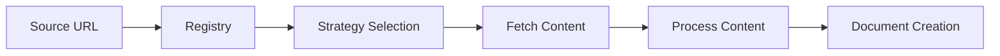
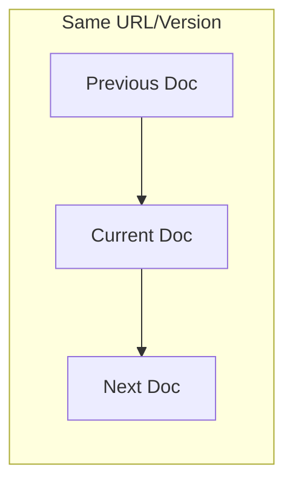

# Documentation MCP Server Architecture

## Overview

The Documentation MCP Server is designed with a modular architecture that ensures feature separation and code reuse between its two main interfaces:

1. Command Line Interface (CLI)
2. Model Context Protocol (MCP) Server

### Core File Naming and Code Quality Conventions

- Files containing classes use PascalCase (e.g., `DocumentProcessingPipeline.ts`, `DocumentManagementService.ts`)
- Other files use kebab-case or regular camelCase (e.g., `index.ts`, `scraper-service.ts`)
- Avoid typecasting where possible. Never use `any` type but prefer `unknown` or `never`.

### Directory Structure

```
src/
├── cli.ts                           # CLI interface implementation
├── index.ts                         # MCP server interface
├── pipeline/                        # Document processing pipeline
├── scraper/                         # Web scraping implementation
│   ├── strategies/                  # Scraping strategies for different sources
│   │   ├── WebScraperStrategy.ts    # Handles HTTP/HTTPS content
│   │   └── LocalFileStrategy.ts     # Handles local filesystem content
│   │   └── ...
│   ├── fetcher/                     # Content fetching abstractions
│   ├── processor/                   # Content processing abstractions
│   └── ...
├── splitter/                        # Document splitting and chunking
├── store/                           # Document storage and retrieval
│   ├── DocumentManagementService.ts # Manages document storage and updates
│   ├── DocumentRetrieverService.ts  # Handles document retrieval and context
│   ├── DocumentStore.ts             # Low-level database interactions
│   └── ...
├── tools/                           # Core functionality tools
├── types/                           # Shared type definitions
└── utils/                           # Common utilities and helpers
```

## Scraper Architecture

The scraping system uses a strategy pattern combined with content abstractions to handle different documentation sources uniformly:

### Content Sources

- Web-based content (HTTP/HTTPS)
- Local filesystem content (file://)
- Package registry content (e.g., npm, PyPI)

Each source type has a dedicated strategy that understands its specific protocol and structure, while sharing common processing logic.

### Content Processing Flow



The registry automatically selects the appropriate strategy based on the URL scheme, ensuring:

- Consistent handling across different content sources
- Unified document format for storage
- Reusable content processing logic

## Tools Layer

The project maintains a `tools/` directory containing modular implementations of core functionality. This design choice ensures that:

- Features are shared and reused across interfaces
- Business logic only needs to be implemented once
- Testing is simplified as core logic is isolated from interface concerns

Current tools include:

- Documentation scraping functionality
- Search capabilities with context-aware results
- Library version management
- Document management operations

The tools interact with the `DocumentManagementService` for managing and retrieving documents. This ensures a consistent interface for all tools and simplifies the integration with the document storage system.

### Document Storage Design

Documents are stored with URLs and sequential ordering to maintain source context:



Search results include surrounding content to provide more complete responses, while maintaining efficient retrieval through compound indexing.

### Document Management and Retrieval

The document storage and retrieval system is divided into two main services:

- **DocumentManagementService:** This service is responsible for managing documents within the store. It handles adding new documents, deleting existing documents, and updating the store. It also includes functionality for finding the best matching version of a library's documentation.
- **DocumentRetrieverService:** This service focuses on retrieving documents and providing contextual information. It handles searching for documents and retrieving related content, such as parent, child, preceding, and subsequent sibling chunks, to provide more complete search results.

This separation of concerns improves the modularity, maintainability, and testability of the system.

### Interface-Specific Adapters

#### CLI (cli.ts)

- Uses Commander.js for command-line argument parsing
- Converts command-line arguments to tool options
- Formats tool results for console output
- Handles CLI-specific error reporting

#### MCP Server (index.ts)

- Implements MCP protocol for AI interaction
- Wraps tool functions in MCP tool definitions
- Formats results as MCP responses
- Provides progress feedback through MCP protocol

### Progress Reporting

The project uses a unified progress reporting system with typed callbacks for all long-running operations. This design:

- Provides real-time feedback across multiple levels (page, document, storage)
- Ensures consistent progress tracking across components
- Supports different output formats for CLI and MCP interfaces
- Enables parallel processing with individual progress tracking through configurable batch-based concurrency

### Logging Strategy

The project uses a centralized logging system through `utils/logger.ts` that maps to console methods. The logging follows a hierarchical approach:

1. **Tools Layer (Highest)**

   - Primary user-facing operations
   - Final results and overall progress
   - Example: Search queries and result counts

2. **Core Components (Middle)**

   - Unique operational logs
   - Store creation and management
   - Example: Vector store operations

3. **Strategy Layer (Lowest)**
   - Detailed progress (page crawling)
   - Error conditions and retries
   - Example: Individual page scraping status

This hierarchy ensures:

- Clear operation visibility
- No duplicate logging between layers
- Consistent emoji usage for better readability
- Error logging preserved at all levels for debugging

### Benefits

1. **Maintainability**

   - Single source of truth for business logic
   - Clear separation of concerns
   - Easier to test and debug

2. **Feature Parity**

   - Guaranteed same functionality in both interfaces
   - Consistent behavior and error handling

3. **Extensibility**
   - Easy to add new tools
   - Simple to add new interfaces (e.g., REST API) using same tools

## Future Considerations

When adding new functionality:

1. Implement core logic in a new tool under `tools/`
2. Consider data relationships and context requirements
3. Design for efficient retrieval patterns
4. Add CLI command in `cli.ts`
5. Add MCP tool in `index.ts`
6. Maintain consistent error handling and progress reporting

When adding new scraping capabilities:

1. Implement a new strategy in `scraper/strategies/`
2. Update the registry to handle the new source type
3. Reuse existing content processing where possible
4. Consider bulk operations and progress reporting
