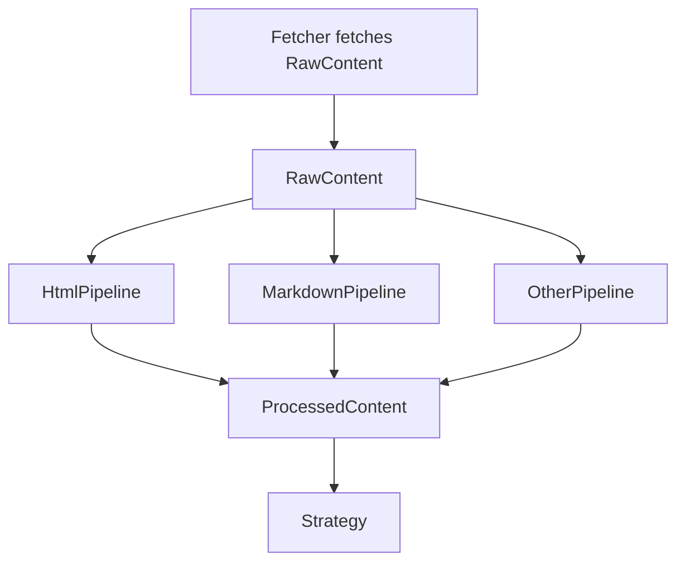
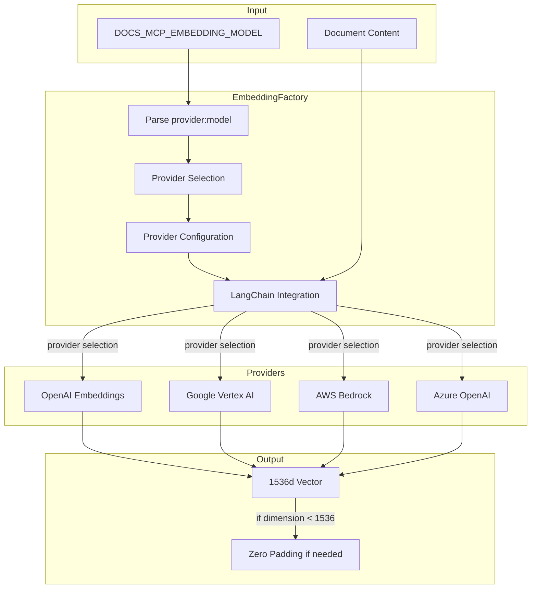
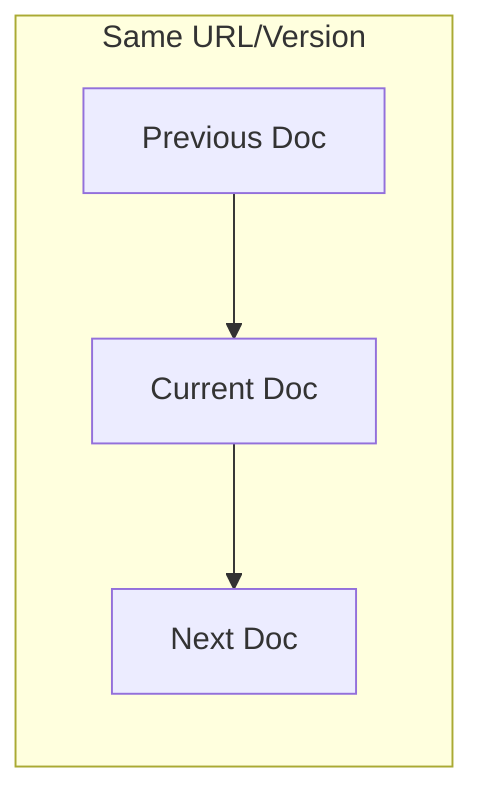
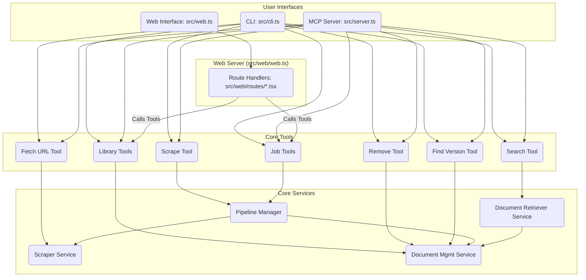

# Documentation MCP Server Architecture

## Overview

The Documentation MCP Server is designed with a modular architecture that ensures feature separation and code reuse between its two main interfaces:

1. Command Line Interface (CLI)
2. Model Context Protocol (MCP) Server

### Core File Naming and Code Quality Conventions

- Files containing classes use PascalCase (e.g., `PipelineManager.ts`, `PipelineWorker.ts`, `DocumentManagementService.ts`)
- Other files use kebab-case or regular camelCase (e.g., `index.ts`, `scraper-service.ts`)
- Avoid typecasting where possible. Never use `any` type but prefer `unknown` or `never`.

## Configuration Management

Default configuration values for the server and its components (e.g., pipeline concurrency, scraping limits) should be defined as constants within the `src/utils/config.ts` file. Avoid hardcoding default values directly within component logic; instead, import and use the constants from this central configuration file. This ensures consistency and simplifies future adjustments.

### Directory Structure

```
src/
├── cli.ts                           # CLI interface implementation
├── server.ts                        # MCP server entry point (uses mcp/index.ts)
├── mcp/                             # MCP server implementation details
├── pipeline/                        # Asynchronous job processing pipeline
│   ├── PipelineManager.ts           # Manages job queue, concurrency, state
│   └── PipelineWorker.ts            # Executes a single pipeline job
├── scraper/                         # Web scraping implementation
│   ├── strategies/                  # Scraping strategies for different sources
│   │   ├── WebScraperStrategy.ts    # Handles HTTP/HTTPS content
│   │   └── LocalFileStrategy.ts     # Handles local filesystem content
│   │   └── ...
│   ├── fetcher/                     # Content fetching abstractions
│   ├── middleware/                  # Content processing pipeline & middleware
│   │   ├── Pipeline.ts              # Orchestrates middleware execution
│   │   ├── types.ts                 # Context and middleware interfaces
│   │   └── components/              # Individual middleware implementations
│   └── ...
├── splitter/                        # Document splitting and chunking
├── store/                           # Document storage and retrieval
│   ├── DocumentManagementService.ts # Manages document storage and updates
│   ├── DocumentRetrieverService.ts  # Handles document retrieval and context
│   ├── DocumentStore.ts             # Low-level database interactions
│   └── ...
├── tools/                           # Core functionality tools
├── types/                           # Shared type definitions
└── utils/                           # Common utilities and helpers
```

## Scraper Architecture

The scraping system uses a strategy pattern combined with content abstractions to handle different documentation sources uniformly:

### Content Sources

- Web-based content (HTTP/HTTPS)
- Local filesystem content (file://)
- Package registry content (e.g., npm, PyPI)

Each source type has a dedicated strategy that understands its specific protocol and structure, while sharing common processing logic.

### Content Processing Flow

Raw content fetched by a strategy's `fetcher` (e.g., HTML, Markdown) is processed through a configurable middleware pipeline. See the Middleware Pipeline section below for details.



- **`ContentProcessingContext`**: An object passed through the pipeline, carrying the content (initially raw, potentially transformed), MIME type, source URL, extracted metadata, links, errors, and options. HTML processing also uses a `dom` property on the context to hold the parsed JSDOM object.
- **`ContentProcessorMiddleware`**: Individual, reusable components that perform specific tasks on the context, such as:
  - Parsing HTML (`HtmlDomParserMiddleware`)
  - Extracting metadata (`HtmlMetadataExtractorMiddleware`, `MarkdownMetadataExtractorMiddleware`)
  - Extracting links (`HtmlLinkExtractorMiddleware`, `MarkdownLinkExtractorMiddleware`)
  - Sanitizing and cleaning HTML (`HtmlSanitizerMiddleware`)
  - Converting HTML to Markdown (`HtmlToMarkdownMiddleware`)
- **`ContentProcessingPipeline`**: Executes a sequence of middleware components in order, passing the context object between them.
- **Strategies (`WebScraperStrategy`, `LocalFileStrategy`, etc.)**: Construct and run the appropriate pipeline based on the fetched content's MIME type. After the pipeline completes, the strategy uses the final `content` and `metadata` from the context to create the `Document` object.

This middleware approach ensures:

- **Modularity:** Processing steps are isolated and reusable.
- **Configurability:** Pipelines can be easily assembled for different content types.
- **Testability:** Individual middleware components can be tested independently.
- **Consistency:** Ensures a unified document format regardless of the source.

### Middleware Pipeline

The core of content processing is the middleware pipeline (`ContentProcessingPipeline` located in `src/scraper/middleware/`). This pattern allows for modular and reusable processing steps.

- **`ContentProcessingContext`**: An object passed through the pipeline, carrying the content (initially raw, potentially transformed), MIME type, source URL, extracted metadata, links, errors, and options. HTML processing also uses a `dom` property on the context to hold the parsed JSDOM object.
- **`ContentProcessorMiddleware`**: Individual, reusable components that perform specific tasks on the context, such as:
  - Parsing HTML (`HtmlDomParserMiddleware`)
  - Extracting metadata (`HtmlMetadataExtractorMiddleware`, `MarkdownMetadataExtractorMiddleware`)
  - Extracting links (`HtmlLinkExtractorMiddleware`, `MarkdownLinkExtractorMiddleware`)
  - Sanitizing and cleaning HTML (`HtmlSanitizerMiddleware`)
  - Converting HTML to Markdown (`HtmlToMarkdownMiddleware`)
- **`ContentProcessingPipeline`**: Executes a sequence of middleware components in order, passing the context object between them.
- **Strategies (`WebScraperStrategy`, `LocalFileStrategy`, etc.)**: Construct and run the appropriate pipeline based on the fetched content's MIME type. After the pipeline completes, the strategy uses the final `content` and `metadata` from the context to create the `Document` object.

This middleware approach ensures:

- **Modularity:** Processing steps are isolated and reusable.
- **Configurability:** Pipelines can be easily assembled for different content types.
- **Testability:** Individual middleware components can be tested independently.
- **Consistency:** Ensures a unified document format regardless of the source.

## Tools Layer

The project maintains a `tools/` directory containing modular implementations of core functionality. This design choice ensures that:

- Features are shared and reused across interfaces
- Business logic only needs to be implemented once
- Testing is simplified as core logic is isolated from interface concerns

Current tools include:

- Documentation scraping functionality
- Search capabilities with context-aware results
- Library version management
- Documentation scraping functionality (now asynchronous via PipelineManager)
- Job management (listing, status checking, cancellation)
- Search capabilities with context-aware results
- Library version management
- Document management operations

The tools interact with the `DocumentManagementService` for managing and retrieving documents, and the `PipelineManager` for handling long-running jobs like scraping. This ensures a consistent interface for all tools and simplifies the integration with the document storage system and job queue.

## Pipeline Architecture

The document processing pipeline is designed as an asynchronous, queue-based system managed by the `PipelineManager`.

- **`PipelineManager`**:
  - Manages a queue of processing jobs (currently just scraping).
  - Controls job concurrency based on configuration (defaulting to 3).
  - Tracks the state (`QUEUED`, `RUNNING`, `COMPLETED`, `FAILED`, `CANCELLED`) and progress of each job.
  - Provides methods (exposed via tools) to enqueue new jobs (`enqueueJob`), get job status (`getJob`, `getJobs`), wait for completion (`waitForJobCompletion`), and request cancellation (`cancelJob`).
  - `enqueueJob` is non-blocking and returns a unique `jobId` immediately.
- **`PipelineWorker`**:
  - Executes a single job dequeued by the `PipelineManager`.
  - Contains the logic for orchestrating scraping (using `ScraperService`) and storing results (using `DocumentManagementService`) for that specific job.
  - Respects cancellation signals passed down from the `PipelineManager`.
- **Cancellation**: Uses the standard `AbortController` and `AbortSignal` pattern to propagate cancellation requests from the manager down through the worker and scraper layers.


### Document Storage Design

The project uses SQLite for document storage, providing a lightweight and efficient database solution that requires no separate server setup.

#### Embedding Generation

Document embeddings are generated using a flexible provider system implemented in `src/store/embeddings/EmbeddingFactory.ts`. This factory supports multiple embedding providers through LangChain.js integrations:



The factory:

- Parses the `DOCS_MCP_EMBEDDING_MODEL` environment variable to determine the provider and model
- Configures the appropriate LangChain embeddings class based on provider-specific environment variables
- Ensures consistent vector dimensions through the `FixedDimensionEmbeddings` wrapper:
  - Models producing vectors < 1536 dimensions: Padded with zeros
  - Models with MRL support (e.g., Gemini): Safely truncated to 1536 dimensions
  - Other models producing vectors > 1536: Not supported, throws error
- Maintains a fixed database dimension of 1536 for all embeddings for compatibility with `sqlite-vec`

This design allows easy addition of new embedding providers while maintaining consistent vector dimensions in the database.

**Database Location:** The application determines the database file (`documents.db`) location dynamically:

1. It first checks for a `.store` directory in the current project directory. If `.store/documents.db` exists, it uses this path. This prioritizes local development databases.
2. If the local `.store/documents.db` does not exist, it defaults to a standard, OS-specific application data directory (e.g., `~/Library/Application Support/docs-mcp-server/` on macOS, `~/.local/share/docs-mcp-server/` on Linux) determined using the `env-paths` library. This ensures a stable, persistent location when running via `npx` or outside a local project context.

Documents are stored with URLs and sequential ordering to maintain source context:



Search results include surrounding content to provide more complete responses, while maintaining efficient retrieval through compound indexing.

### Document Management and Retrieval

The document storage and retrieval system is divided into two main services:

- **DocumentManagementService:** This service is responsible for managing documents within the store. It handles adding new documents, deleting existing documents, and updating the store. It also includes functionality for finding the best matching version of a library's documentation.
- **DocumentRetrieverService:** This service focuses on retrieving documents and providing contextual information. It handles searching for documents and retrieving related content, such as parent, child, preceding, and subsequent sibling chunks, to provide more complete search results.

This separation of concerns improves the modularity, maintainability, and testability of the system.

### Web Interface

The web interface provides a GUI for interacting with the server, monitoring jobs, and viewing indexed libraries. It follows a server-side rendered architecture using modern web technologies, emphasizing modularity through reusable components.

#### Technology Stack

- **Fastify:** Web server framework
- **`@kitajs/html`:** Server-side JSX rendering for component-based UI
- **HTMX:** Dynamic content updates without full page reloads
- **Tailwind/Flowbite:** Styling via CDN

#### Component Structure

The web interface is organized into logical parts:

- **Entry Point (`src/web.ts`):** Server initialization and environment setup.
- **Core Server (`src/web/web.ts`):** Configures Fastify, registers plugins, instantiates services/tools, and maps routes to handlers.
- **Routes (`src/web/routes/`):** Contains route handler modules, organized into subdirectories by feature (e.g., `jobs/`, `libraries/`). These handlers fetch data using the core Tools and compose the UI using components. The root `index.tsx` defines the main page structure.
- **Components (`src/web/components/`):** Contains reusable JSX components (e.g., Layout, JobItem, LibraryList, Alert) responsible for rendering specific parts of the UI. These components receive data as props from the route handlers.

This structure separates routing and data fetching logic (in `routes/`) from presentation logic (in `components/`), promoting code reuse and maintainability.

#### Integration Flow



#### AlpineJS and HTMX Interaction Pattern

When using AlpineJS for component state management alongside HTMX for dynamic updates, avoid calling the global `htmx` object directly from within Alpine event handlers (`x-on:`, `@`). Due to potential scope limitations in Alpine's expression evaluation, this can lead to "htmx is not defined" errors.

**Recommended Pattern:**

1.  **Alpine Dispatches Event:** Let the Alpine component manage its state. When an action requires triggering an HTMX request, use `$el.dispatchEvent` to dispatch a standard browser `CustomEvent` from the element.
    ```html
    <button
      x-data="{...}"
      x-on:click="if (confirmed) $el.dispatchEvent(new CustomEvent('confirmed-action'))"
    >
      ...
    </button>
    ```
2.  **HTMX Listens for Event:** Configure the `hx-trigger` attribute on the same element to listen for the dispatched custom event name.
    ```html
    <button ... hx-post="/do-something" hx-trigger="confirmed-action">
      ...
    </button>
    ```

This approach uses standard browser events as the communication bridge, decoupling Alpine's internal scope from HTMX.

The web interface leverages HTMX for dynamic updates, allowing partial page refreshes for job status and library list changes without full page reloads. Static assets are served from the `public` directory with `index: false` to prevent interference with dynamic routes.

### Interface-Specific Adapters

#### CLI (cli.ts)

- Uses Commander.js for command-line argument parsing
- Converts command-line arguments to tool options
- Formats tool results for console output
- Handles CLI-specific error reporting

#### MCP Server (index.ts)

- Implements MCP protocol for AI interaction
- Wraps tool functions in MCP tool definitions
- Formats results as MCP responses
- Provides progress feedback through MCP protocol (Note: Currently reports job start via message, detailed progress TBD)

The MCP server exposes the following tools:

- `scrape_docs`: Starts a scraping job.
- `search_docs`: Searches the indexed documentation.
- `list_libraries`: Lists all indexed libraries.
- `find_version`: Finds the best matching version for a library.
- `remove_docs`: Removes indexed documents.
- `fetch_url`: Fetches a single URL and converts to Markdown.
- `list_jobs`: Lists active/completed jobs.
- `get_job_info`: Retrieves the status and progress of a specific job.
- `cancel_job`: Attempts to cancel a running or queued job.

### Progress Reporting

The project uses a unified progress reporting system via callbacks managed by the `PipelineManager`. This design:

- Provides job-level status updates (`onJobStatusChange`).
- Provides detailed progress updates during job execution (`onJobProgress`), including page scraping details.
- Reports errors encountered during document processing within a job (`onJobError`).
- Ensures consistent progress tracking across components via `PipelineManagerCallbacks`.
- Supports different handling of progress/status for CLI (waits for completion) and MCP (returns `jobId` immediately).
- Concurrency is managed by the `PipelineManager`, not just batching within strategies.

### Logging Strategy

The project uses a centralized logging system through `utils/logger.ts` that maps to console methods. The logging follows a hierarchical approach:

1. **Tools Layer (Highest)**

   - Primary user-facing operations
   - Final results and overall progress
   - Example: Search queries and result counts

2. **Core Components (Middle)**

   - Unique operational logs
   - Store creation and management
   - Example: Vector store operations

3. **Strategy Layer (Lowest)**
   - Detailed progress (page crawling)
   - Error conditions and retries
   - Example: Individual page scraping status

This hierarchy ensures:

- Clear operation visibility
- No duplicate logging between layers
- Consistent emoji usage for better readability
- Error logging preserved at all levels for debugging

### Benefits

1. **Maintainability**

   - Single source of truth for business logic
   - Clear separation of concerns
   - Easier to test and debug

2. **Feature Parity**

   - Guaranteed same functionality in both interfaces
   - Consistent behavior and error handling

3. **Extensibility**
   - Easy to add new tools
   - Simple to add new interfaces (e.g., REST API) using same tools

## Testing Conventions

This section outlines conventions and best practices for writing tests within this project.

### Mocking with Vitest

When mocking modules or functions using `vitest`, it's crucial to follow a specific order due to how `vi.mock` hoisting works. `vi.mock` calls are moved to the top of the file before any imports. This means you cannot define helper functions _before_ `vi.mock` and then use them _within_ the mock setup directly.

To correctly mock dependencies, follow these steps:

1.  **Declare the Mock:** Call `vi.mock('./path/to/module-to-mock')` at the top of your test file, before any imports or other code.
2.  **Define Mock Implementations:** _After_ the `vi.mock` call, define any helper functions, variables, or mock implementations you'll need.
3.  **Import the Actual Module:** Import the specific functions or classes you intend to mock from the original module.
4.  **Apply the Mock:** Use the defined mock implementations to replace the behavior of the imported functions/classes. You might need to cast the imported item as a `Mock` type (`import { type Mock } from 'vitest'`).

**Example Structure:**

```typescript
import { vi, type Mock } from "vitest";

// 1. Declare the mock (hoisted to top)
vi.mock("./dependency");

// 2. Define mock function/variable *after* vi.mock
const mockImplementation = vi.fn(() => "mocked result");

// 3. Import the actual function/class *after* defining mocks
import { functionToMock } from "./dependency";

// 4. Apply the mock implementation
(functionToMock as Mock).mockImplementation(mockImplementation);

// ... rest of your test code using the mocked functionToMock ...
// expect(functionToMock()).toBe('mocked result');
```

This structure ensures that mocks are set up correctly before the modules that depend on them are imported and used in your tests.

## Releasing

This project uses [semantic-release](https://github.com/semantic-release/semantic-release) and [Conventional Commits](https://www.conventionalcommits.org/) to automate the release process.

**How it works:**

1.  **Commit Messages:** All commits merged into the `main` branch **must** follow the Conventional Commits specification.
2.  **Manual Trigger:** The "Release" GitHub Actions workflow can be triggered manually from the Actions tab when you're ready to create a new release.
3.  **`semantic-release` Actions:** Determines version, updates `CHANGELOG.md` & `package.json`, commits, tags, publishes to npm, and creates a GitHub Release.

**What you need to do:**

- Use Conventional Commits.
- Merge changes to `main`.
- Trigger a release manually when ready from the Actions tab in GitHub.

**Automation handles:** Changelog, version bumps, tags, npm publish, GitHub releases.

## Future Considerations

When adding new functionality:

1. Implement core logic in a new tool under `tools/`
2. Consider data relationships and context requirements
3. Design for efficient retrieval patterns
4. Add CLI command in `cli.ts`
5. Add MCP tool in `index.ts`
6. Maintain consistent error handling and progress reporting

When adding new scraping capabilities:

1. Implement a new strategy in `scraper/strategies/`
2. Update the registry to handle the new source type
3. Reuse existing content processing where possible
4. Consider bulk operations and progress reporting
