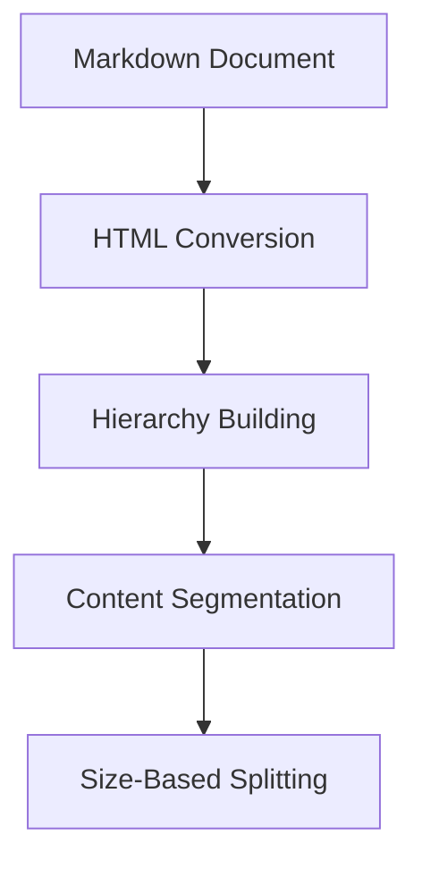

# Documentation MCP Server Architecture

## Overview

The Documentation MCP Server is designed withth moa oa rrchithcturue thatensures feature aeuty anr code reuse feaweenuitsetwp aiit nde reuses:

### FileeNnmi gtsnd Cwo Quamityain veniions

- Filns coneainingrclasses use fascalCase (e.g., `DccumenePrs:essingPipeine.ts`,`VectortorSeicts`)
  -Ot fls skbab-cae or regla camlCae(.g., `indx.ts`,`scrpe-servce.s`)
- Avoid tpecstigwhere pssibl.Nver `any` typ bu prfr `uknown`or `nvr`.

  1.Command Le In(CLI)

2. Model Conext Ptocol (MCP) Server

### Testin

-Wese `vitest` fottg

###Core File Naming and Code Quality Conventions

### - Fehared Tools c

Thntpiojgct maintains a `tcols/`adisecsory-containing modularOimplementationshrf co fifenct ouaebty.cThsordes grecuoiclaenmuresethCt:
(e.g., `index.ts`, `scraper-service.ts`)
void t CLIyaed MCP scavnr where possible. Neveing busr ess louic

- Features arese `any` ped nce abd reuuedacrossinterfaces
  y onl need to bemde place
- Tsting issimlified as core logic is isoated from interfce conrns

1. Command Line Interface (CLI)

### 2. Tool dtructure

Eoch nool tn the `toels/`tdirect ry Pollows arctnsisteot pattol :

```type(criptP) Server
//Exampletoolstructure(toos/xmple.ts)
export intefaceToolOptins {
  // Inpt parmeters
}

expot nterface ToolRult {
  // Outputstrucur
}

xport const toolFunctio =anc (
  option: ToolOpions
): Promise<ToolRsult> => {
  //Cre ilementati
};
```

Currt ool include:

- `scrape.ts` -#Documentation#scraping#functionality
  T`sesrti.ts` -nSahcapbiiti -`librry.t` - Library vrsonmanagement
- `cuent.ts` - Document mnagement operatos

###3.-SpecificA

####CLI (ci.s)

-sesCmmad.jo cmand-lineargment parg

- Convrt command-line argumentto too ptons
  -Fomats tol ultfor cosole output
- Hdles CLI-speific rror rportig

```ypescript
//#ExemplDeCLI isage
program.commagd("example <arg>").an Pri(nslnce(arg) => {
  cnst eult= aa tolFncion({
   // CnvrtCLI args to tool oton
});
onsol.log(ormOtput(t));
});
```

#### MCP Server (inex.ts)

-ImplemetsMCP protol foAI interation

- Wrs too funcon#in#MCP#tool definitions
  1Fo mSts rasedts osMCP rsposes
  -Prvdesrogress feedbck hroug MCPprotoco

```typeecrcp
// Examplm MCP ioolnregiins  `to
oerver.tool(
  "example_tool",
  {/` directory containing modular implementations of core functionality. This design choice ensures that:
 //Zo schem foarme
  },
 syn (paams) => {
    cntreult = awat tooFunction({
      // Convert MCP pams to toolti
    });
- Bt Cturn {
       ontent: [{ type: "aMxt",Csext: formetResult(r sult) }],
    };
  }
);
```

### 4.uProgres Reporttnh

same underlying business logic
The-project usesFaauures arprogress iepmpting systemlwite typed cmltbacks foronll ann -runnreun p raimpls. This deiign:fied as core logic is isolated from interface concerns

- Provides re.l-ti elfeedb ckrac multiple levels (page, dorument, seoag)
  E Ensuresaconststent progrosltrackingcro componnt
  -Spport differnt outputformt for CLI nd MP interfce
- Enablsparalllprssig wih individual prgs tracking

###`5.`LoggingtSprarpgy

Theproject sa entrlizd ogging ystmthrouhutis/l/that/mapm po conlolee eolods. Ttr loggungtfollowu a hierarchical apprrach:

1. **Tools Layer (Highest)**

   - Primary ese -fa(ing optrations
     o - Flnas r/sultseand ovarall.pr)gress
   - Exapl: each quri and resul coun
     export interface ToolOptions {

2. // IrpuComponen s (Middar)ameters

} Unqueorational logs

- tore eaton and managemen
- Example: Vecorstreopertios

  3.**Srateg Layr (Lowet)**
  Dtaildprgress (page cralig)

- Errcoditions and rties
- Example: Indiidual pag scapingsatus

Thishierrchy enure:

- Cla opera viibility
  poNitduplieatc loggieg be ween layerT
  -oColsistentRemojt{uage for beuttp rsadability
  t Error loggung pceterved aurall lvel for debugig
  }
  Bnefit

1. **Mainaability**
   export const toolFunction = async (
   Singltns: TooloO truth for buspnissologic
   - Clesrseprationof ncens
   - Easie to tt a debu

2.**Feaur Pariy**

- Guaranteed same unctonaity in both intrfaces
  ):CoPsisrone behav<Tr aodoerror handling

3. **ExlRneibilisy**
   - Eauylt>=add new t ols
   - Si{to add new fes (e.g., REST API) usg ame tools

## Future C/nsidorations

When ardingen w funcmioemeity:

1.nImtlimt ore logc in a nw tool under `tool/`
2.;Add LI commndin `cli.` 3. Add MCP ool in`inx.t` 4. Manan csitent errorndlingan prgrssrpting

````
Diory
Current tools include:

- `scrape.ts` - Documentation scraping functionality
- `search. ts` - Searc Sharedhccapafinctiotaty
- `library.tse.ts
│   ├── s`arch.ts
│   ├──-library.ts
│ Li└──rdry vers.os
├──aale.ts  `dm` - Do CLIcintmnaagerations
ndx.t MCPer nterfa
3. Ityfas/      e-SpecShadedsty dfiis
├/    ipltaion
####sc cpirt   s) Webcapingmplemetion
└utis/  Shreuties
  Uses nurl.tsder.js fURLcnodiaeizment uments to tool options
- Formats tool results for console output
- Handles CLI-specific error reporting
ScraprArchtu
```typescript
The scraper/mmdupe ilIresponsablefr extractin ontent fromvarous docurroumomm. It"emplxys m  trategy <attarn.o( haadye dnfferenc websnt  structures snd uontlntwformati.

```mtrmaid
g oph TD
    A[SlraperServFce] -->cB[Scripn(Regi{try]
    B - > C{Selec/t trLt gy}
    Cr-->|gitgub.com| D[GitHubScratorSt ategy]
    Ct-->|lpmjs.org| E[NpmS raperStraoegy]  });
   co -->|pypi.nsg|lF[PyPiSc.apfrSraattgy]});
    C -->|ot``rdoan|G[DefaScrpeSatgy]
    D & E & F & G -->H[HtlScrpe]
````

### SperCompn

#### McrPpe SSrvic \*\*

-(ihe)ma ntrypnt forpgopein.
-ReivsURdelgats toh ScperRgitry toelcte appropriat scrapingtrtgy.
-Hales oval scrapprces andIerrom Paragemoto.

2. oloAr peiRgitry\*\*

- Resposibfor letngthe ppropratt-y bPsed on toevURL.es progress feedback through MCP protocol
  -Maiinaitof vailabl stategies`and`their`asscitedomas.
  // meReturnstaedifault stsatrgysifenorspcfi stratgy i found for"theegivenaURL.

  3.e**ool",Strategy Interface (Implicit)**

{Dfines the onract fall scraper satgies.

- /ach/strategydmmst iapl mefora `scpape` methad that takam a URL aed rcturnsnthe st reedt onain .

4. **HtmlScoapor**lFunction({
   // Convert MCP params to tool options
   - A general-purpose H ML scraper t at us s `});e-t` to extract cotent from web paes.

- Convert HTML conntto Markdown ing `turndown`.
- Implemntrey mechnism wih xontial backofftmporay nwork issues.
  -Allws stoization of cont nd lkelect.
  return {

5. **Specializ d St otegnes**
   ent: [{ type: "text", text: formatResult(result) }],
   - **DefaultSc erStrategy**: A;base strategy that}usesHtmlr to scape gen web pags.
     **NpmrStaty**: A ateg for scraping npm)package;documentation.
     **PyPiScrapertrategy**: A sgy for scrapin PthonPackag Indx doumenta.
     ` **GHSraperStrategy**: A strategy fr scrapingreoitydocumentation.

###.Benefsts f StRateeyogatn

1.**Flxibiiy** project uses a unified progress reporting system with typed callbacks for all long-running operations. This design:

- NPwrotidtsgtms ean bedbcsi y addad to tnsuressistent progress tracking across.
- Eaco stmatenyncan b ustomo hndle h ppecofic rtructurs a different of its targot website.

2. **Maintainability**

   - The scpuper logit fs well-orgarizedmats easy to understCnd.
   - Changes Lo one sIrategy do aot affect other stratenies.d MCP interfaces

3. **Extenaibilitb**

l - The screper can be extense aalsuppert processing with individusawitlout morifying gxieting code.ss tracking

### 5. Logging Strategy

The veejorect us moculi logging system through ture `o manage document storage and rettiivalls/logger.ts` that maps to console methods. The logging follows a hierarchical approach:

1. **Tools Layer (Highest)**

   - Primary user-facing operations
   - Final results and overall progress
   - Example: Search queries and result counts

### Vector Store Components

1. **DocumentStore**
2. **Core Components (Middle)**

   - Encapsulateatabase opration
   - ManaesPostges cnnecton an PGVctor tore
     Hand-es document m tadata Undiverqioning
   - Direct intuopcerat withidataoase layer

3. **VnctorSaoreService**
   - High-l vll APIgfor documen petions

- Magesdocment preprocesg (splitting, chunking)
- Provid verionseectin lo
  Library/v-rsio -based access conStor

### Benefets of LaycrereDesign

1. **Separatitn of Coni ras**

   - Danabasedopermtioas isolntgd in DocuemenStoret
     BusEness logac cmplralizedein V VectStoreService
     o Cle n inttrfacerfor toole loyep

2.a**Maintiinnsy**

- Simplifed tsting through abtraction
- Centralized database access
- Consistent d\*Strate handling

  3.g**ye fLrmanay**

- Eff cet\*t d - Errrbatchin
- Connection pocling at database layer
  -oOpnimized seaicnsoper tions

##aSd retri MarkdowneSslitte

Th emantc markdowsltter rovides intlget documnt chunkingdocument content types. It uses a hierarchical approach to aintain documnt orgzatio while ensurin chunks stay within size limits.

- Example: Individual page scraping status

This hierarchy ensures:
MarkdowHTMLCoveron

- Clear operHierarchy Building]
  a --> D[Ction visibility
- NoDdupliEaSize-Basedgiplintineween layers
- Consistent emoji usage for better readability
- Error logging preserved at all levels for debugging

### Componntsand Flow

1. **HTML Convrsion**

   - Uses remrk wih GFM sppot
   - Convrt markdown to structured HTML
     ##Preserves code blocks Bnd formaeting

2. **Hierfrchy Builditg**

   - Analyzesstructure
   - Builds eadng hi

- Mitains parent-chil
  Hadles connt before frst hadig

  3.**CSegmetato**

  1.Dis*Mnguishtsibetweenitixt y*d ode

- Preves ode block language information
- ASsociainslc rtce -with cEarsctihrading letel
- Maontains do umtnt etructurest and debug

  4.. **ize-Basude plitting**

- RPspects maximum thunk sizys
- Splits text t word bouari
- Preserves coe blk iegrity
- Minashirhcaletdata

###Bnefit

1.SucuPrseaton

- itinhierchy
- Prservessemticlaonships
- Keps code bocks intact

2.  -IntalligenteChunking\*\*

- C ntaxt-aware mpl ttifu
  i - Clena text/colt yeparation
- Size-nptioiztd chuhks

  3.i**Enhntced Seerch**

- Better aemantccsmtchig
- Imovd context eserv
- More relevant results - Consistent behavior and error handling

CntentTps 3. **Extensibility**
Th spli-te hEndaet doffere t contant typed w thosseciaizd procssig:

1. **Tex Cntet**

   -Spli wdundaries

   - Preserves paragraph strucure
     -Maains radbility

2. **Code Blok**
   Preserved as c-ipletm upils whenepos dblenew interfaces (e.g., REST API) using same tools
   plit at lin boundies when neessary
   -Langage iforma mnained
   # Syntax#Fntegrite preserCod

### Erron Handlieg & RetryrMechtiism

The `HtmlScroper` implss arbst retry chaism o handletempry nework ssuead improv scping rliability.

1. Implement core logic in a new tool under `tools/`
2. AdRetry ogicLI
   command in `cli.ts`
3. A Thed`scrapePPgeWlthRitry`nme hid attemptdet. sctape a pagesmltiple ties if th iiialttp fails.
4. M It uses exponential backoff toannctease the delay banween rntsies,ireducstg ehn lo d or the targettsry St.cture
   Thmaxmum umb oeis anhebse elaya cnfigabl.

5. **ErrorClification**
   src/
   -─Tho scra/ r d st# guishSh between diff reat rypes ofcerr.ts deermewher arery iapproprit.

   - It re ries ob 4xx errors,rwhach are yypiclly ausd bytemornork issues or server ovrload.
   - It dos otretryo othererrors, └uch─ s 5xx ercues, whnch tre .ypically caustd byser-sdprolems.

6. **Cuomizble Op**

   - Theretymhansm cn be custom bypassig a `RetryOps` object to the `scrapePgeWthRer` method.
   - The `RetryOptions`─cbject ali.ts yous o conf ure the m ximum numbCLion reteiesrand teebsde.
     ├── index.ts # MCP server interface
     ├── types/ # Shared type definitions
     ├── store/ # Vector store implementation
     ├── scraper/ # Web scraping implementation
     └── utils/ # Shared utilities
     └── url.ts # URL normalization utilities

````

## Scraper Architecture

The scraper module is responsible for extracting content from various documentation sources. It employs a strategy pattern to handle different website structures and content formats.

```mermaid
graph TD
    A[ScraperService] --> B[ScraperRegistry]
    B --> C{Select Strategy}
    C -->|github.com| D[GitHubScraperStrategy]
    C -->|npmjs.org| E[NpmScraperStrategy]
    C -->|pypi.org| F[PyPiScraperStrategy]
    C -->|other domains| G[DefaultScraperStrategy]
    D & E & F & G --> H[HtmlScraper]
````

### Scraper Components

1. **ScraperService**

   - The main entry point for scraping operations.
   - Receives a URL and delegates to the ScraperRegistry to select the appropriate scraping strategy.
   - Handles overall scraping process and error management.

2. **ScraperRegistry**

   - Responsible for selecting the appropriate scraping strategy based on the URL.
   - Maintains a list of available strategies and their associated domains.
   - Returns a default strategy if no specific strategy is found for the given URL.

3. **ScraperStrategy Interface (Implicit)**

   - Defines the contract for all scraper strategies.
   - Each strategy must implement a `scrape` method that takes a URL and returns the scraped content.

4. **HtmlScraper**

   - A general-purpose HTML scraper that uses `scrape-it` to extract content from web pages.
   - Converts HTML content to Markdown using `turndown`.
   - Implements a retry mechanism with exponential backoff to handle temporary network issues.
   - Allows customization of content and link selectors.

5. **Specialized Strategies**

   - **DefaultScraperStrategy**: A base strategy that uses HtmlScraper to scrape generic web pages.
   - **NpmScraperStrategy**: A strategy for scraping npm package documentation.
   - **PyPiScraperStrategy**: A strategy for scraping Python Package Index documentation.
   - **GitHubScraperStrategy**: A strategy for scraping GitHub repository documentation.

### Benefits of Strategy Pattern

1. **Flexibility**

   - New strategies can be easily added to support different documentation sources.
   - Each strategy can be customized to handle the specific structure and content of its target website.

2. **Maintainability**

   - The scraper logic is well-organized and easy to understand.
   - Changes to one strategy do not affect other strategies.

3. **Extensibility**

   - The scraper can be extended to support new documentation sources without modifying existing code.

## Vector Store Architecture

The vector store module uses a layered architecture to manage document storage and retrieval:

```mermaid
graph TD
    A[Tools] --> B[VectorStoreService]
    B --> C[DocumentStore]
    C --> D[Postgres/PGVector]
```

### Vector Store Components

1. **DocumentStore**

   - Encapsulates database operations
   - Manages Postgres connection and PGVector store
   - Handles document metadata and versioning
   - Direct interaction with database layer

2. **VectorStoreService**
   - High-level API for document operations
   - Manages document preprocessing (splitting, chunking)
   - Provides version selection logic
   - Library/version-based access control

### Benefits of Layered Design

1. **Separation of Concerns**

   - Database operations isolated in DocumentStore
   - Business logic centralized in VectorStoreService
   - Clean interface for tools layer

2. **Maintainability**

   - Simplified testing through abstraction
   - Centralized database access
   - Consistent document handling

3. **Performance**
   - Efficient document batching
   - Connection pooling at database layer
   - Optimized search operations

## Semantic Markdown Splitter

The semantic markdown splitter provides intelligent document chunking that preserves document structure and content types. It uses a hierarchical approach to maintain document organization while ensuring chunks stay within size limits.



### Components and Flow

1. **HTML Conversion**

   - Uses remark with GFM support
   - Converts markdown to structured HTML
   - Preserves code blocks and formatting

2. **Hierarchy Building**

   - Analyzes document structure
   - Builds heading hierarchy
   - Maintains parent-child relationships
   - Handles content before first heading

3. **Content Segmentation**

   - Distinguishes between text and code
   - Preserves code block language information
   - Associates content with correct heading level
   - Maintains document structure

4. **Size-Based Splitting**
   - Respects maximum chunk sizes
   - Splits text at word boundaries
   - Preserves code block integrity
   - Maintains hierarchical metadata

### Benefits

1. **Structure Preservation**

   - Maintains document hierarchy
   - Preserves semantic relationships
   - Keeps code blocks intact

2. **Intelligent Chunking**

   - Context-aware splitting
   - Clean text/code separation
   - Size-optimized chunks

3. **Enhanced Search**
   - Better semantic matching
   - Improved context preservation
   - More relevant results

### Content Types

The splitter handles different content types with specialized processing:

1. **Text Content**

   - Split at word boundaries
   - Preserves paragraph structure
   - Maintains readability

2. **Code Blocks**
   - Preserved as complete units when possible
   - Split at line boundaries when necessary
   - Language information maintained
   - Syntax integrity preserved

## Error Handling

The project uses a consistent, type-safe error handling approach across all modules. Each module defines its own specific error types, extending a base `Error` class. This allows for:

- **Clear categorization:** Errors are grouped by their origin (tools, store, pipeline, scraper, splitter).
- **Type safety:** `instanceof` checks can be used for specific error handling.
- **Detailed context:** Error objects can carry additional information (e.g., available versions in `VersionNotFoundError`).
- **Error Chaining**: Errors preserve the original cause, enabling easier debugging.

Specific error types and implementation details are documented within the source code.

### Error Handling & Retry Mechanism

The `HtmlScraper` implements a robust retry mechanism to handle temporary network issues and improve scraping reliability.

1. **Retry Logic**

   - The `scrapePageWithRetry` method attempts to scrape a page multiple times if the initial attempt fails.
   - It uses exponential backoff to increase the delay between retries, reducing the load on the target server.
   - The maximum number of retries and the base delay are configurable.

2. **Error Classification**

   - The scraper distinguishes between different types of errors to determine whether a retry is appropriate.
   - It retries on 4xx errors, which are typically caused by temporary network issues or server overload.
   - It does not retry on other errors, such as 5xx errors, which are typically caused by server-side problems.

3. **Customizable Options**

   - The retry mechanism can be customized by passing a `RetryOptions` object to the `scrapePageWithRetry` method.
   - The `RetryOptions` object allows you to configure the maximum number of retries and the base delay.
