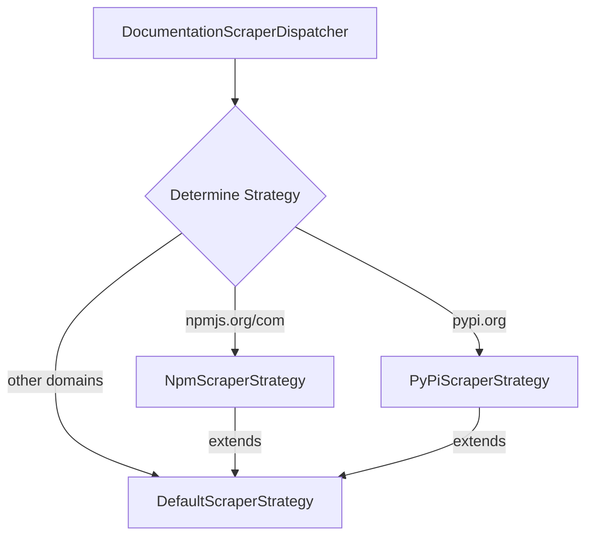

# Documentation MCP Server Architecture

## Overview

The Documentation MCP Server is designed with a modular architecture that ensures feature parity and code reuse between its two main interfaces:

1. Command Line Interface (CLI)
2. Model Context Protocol (MCP) Server

## Core Design Principles

### 1. Shared Tooling

The project maintains a `tools/` directory containing modular implementations of core functionality. This design choice ensures that:

- Both CLI and MCP server use the same underlying business logic
- Features are implemented once and reused across interfaces
- Changes to functionality only need to be made in one place
- Testing is simplified as core logic is isolated from interface concerns

### 2. Tool Structure

Each tool in the `tools/` directory follows a consistent pattern:

```typescript
// Example tool structure (tools/example.ts)
export interface ToolOptions {
  // Input parameters
}

export interface ToolResult {
  // Output structure
}

export const toolFunction = async (
  options: ToolOptions
): Promise<ToolResult> => {
  // Core implementation
};
```

Current tools include:

- `scrape.ts` - Documentation scraping functionality
- `search.ts` - Search capabilities
- `library.ts` - Library version management
- `document.ts` - Document management operations

### 3. Interface-Specific Adapters

#### CLI (cli.ts)

- Uses Commander.js for command-line argument parsing
- Converts command-line arguments to tool options
- Formats tool results for console output
- Handles CLI-specific error reporting

```typescript
// Example CLI usage
program.command("example <arg>").action(async (arg) => {
  const result = await toolFunction({
    // Convert CLI args to tool options
  });
  console.log(formatOutput(result));
});
```

#### MCP Server (index.ts)

- Implements MCP protocol for AI interaction
- Wraps tool functions in MCP tool definitions
- Formats results as MCP responses
- Provides progress feedback through MCP protocol

```typescript
// Example MCP tool registration
server.tool(
  "example_tool",
  {
    // Zod schema for parameters
  },
  async (params) => {
    const result = await toolFunction({
      // Convert MCP params to tool options
    });
    return {
      content: [{ type: "text", text: formatResult(result) }],
    };
  }
);
```

### 4. Progress Reporting

Tools that involve long-running operations support progress reporting through callback functions. This allows both interfaces to provide appropriate feedback:

- CLI: Console output with progress information
- MCP: Structured progress updates through the MCP protocol

### 5. Logging Strategy

The project uses a centralized logging system through `utils/logger.ts` that maps to console methods. The logging follows a hierarchical approach:

1. **Tools Layer (Highest)**

   - Primary user-facing operations
   - Final results and overall progress
   - Example: Search queries and result counts

2. **Core Components (Middle)**

   - Unique operational logs
   - Store creation and management
   - Example: Vector store operations

3. **Strategy Layer (Lowest)**
   - Detailed progress (page crawling)
   - Error conditions and retries
   - Example: Individual page scraping status

This hierarchy ensures:

- Clear operation visibility
- No duplicate logging between layers
- Consistent emoji usage for better readability
- Error logging preserved at all levels for debugging

## Benefits

1. **Maintainability**

   - Single source of truth for business logic
   - Clear separation of concerns
   - Easier to test and debug

2. **Feature Parity**

   - Guaranteed same functionality in both interfaces
   - Consistent behavior and error handling

3. **Extensibility**
   - Easy to add new tools
   - Simple to add new interfaces (e.g., REST API) using same tools

## Future Considerations

When adding new functionality:

1. Implement core logic in a new tool under `tools/`
2. Add CLI command in `cli.ts`
3. Add MCP tool in `index.ts`
4. Maintain consistent error handling and progress reporting

## Directory Structure

```
src/
├── tools/           # Shared core functionality
│   ├── scrape.ts
│   ├── search.ts
│   ├── library.ts
│   └── document.ts
├── cli.ts          # CLI interface
├── index.ts        # MCP server interface
├── types/          # Shared type definitions
├── store/          # Vector store implementation
├── scraper/        # Web scraping implementation
└── utils/          # Shared utilities
    └── url.ts      # URL normalization utilities
```

## Scraper Strategy Pattern

The documentation scraper uses the Strategy pattern to handle different types of documentation sources:



### Scraper Components

1. **DocumentationScraperDispatcher**

   - Entry point for scraping operations
   - Analyzes the target URL to determine appropriate strategy
   - Instantiates and delegates to specific scraper strategies

2. **ScraperStrategy Interface**

   - Defines contract for all scraper implementations
   - Ensures consistent scraping behavior across strategies

3. **DefaultScraperStrategy**

   - Base implementation for web scraping
   - Handles generic documentation sites
   - Can be extended by specific strategies

4. **Specialized Strategies**
   - **NpmScraperStrategy**: Optimized for npm package documentation
     - Uses removeQuery URL normalization
     - Extends DefaultScraperStrategy
   - **PyPiScraperStrategy**: Handles Python Package Index docs
     - Uses removeQuery URL normalization
     - Extends DefaultScraperStrategy

### Benefits of Strategy Pattern

1. **Flexibility**

   - Easy to add new strategies for different documentation sources
   - Each strategy can implement custom scraping logic
   - Common functionality shared through DefaultScraperStrategy

2. **Maintainability**

   - Clear separation of concerns
   - Each strategy isolated and focused
   - Easy to modify specific scraping behavior

3. **Extensibility**
   - New strategies can be added without modifying existing code
   - Future support for sites like Mintlify, ReadMe.com planned

### Error Handling & Retry Logic

The scraper implements a robust error handling system with clear distinction between different types of failures:

1. **Error Classification**

   - **InvalidUrlError**: Validation errors for malformed URLs
   - **ScraperError**: Base error class for scraping operations
     - `isRetryable`: Flag indicating if error can be retried
     - `cause`: Original error that caused the failure
     - `statusCode`: HTTP status code if applicable

2. **Retry Strategy**

   - Only retry on 4xx HTTP errors
   - Non-4xx errors fail immediately
   - Exponential backoff between retry attempts
   - Clear separation between scraping and retry logic

3. **Implementation Pattern**
   - `scrapePageContent`: Core scraping logic
   - `scrapePageContentWithRetry`: Retry mechanism wrapper
   - Clean separation of concerns for better maintainability
