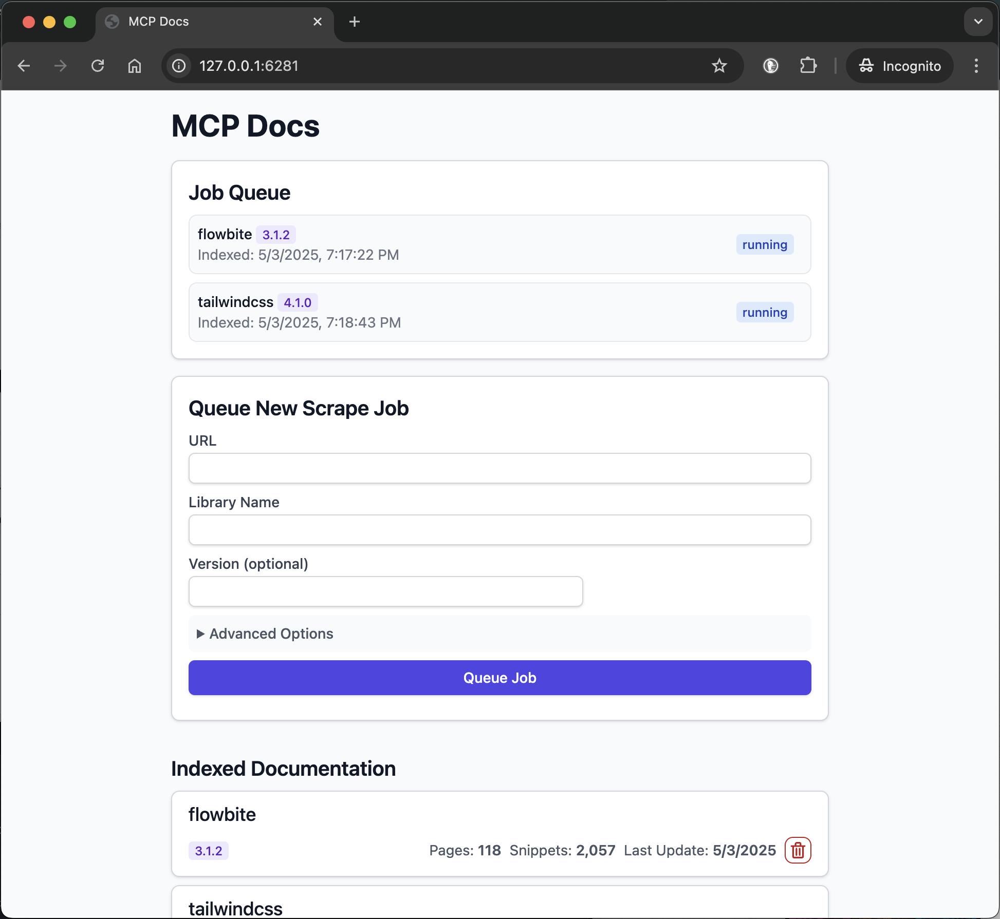

# Docs MCP Server: Your AI's Up-to-Date Documentation Expert

AI coding assistants often struggle with outdated documentation, leading to incorrect suggestions or hallucinated code examples. Verifying AI responses against specific library versions can be time-consuming and inefficient.

The **Docs MCP Server** solves this by acting as a personal, always-current knowledge base for your AI assistant. Its primary purpose is to **index 3rd party documentation** – the libraries you actually use in your codebase. It scrapes websites, GitHub repositories, package managers (npm, PyPI), and even local files, cataloging the docs locally. It then provides powerful search tools via the Model Context Protocol (MCP) to your coding agent.

This enables your LLM agent to access the **latest official documentation** for any library you add, dramatically improving the quality and reliability of generated code and integration details.

By grounding AI responses in accurate, version-aware context, the Docs MCP Server enables you to receive concise and relevant integration details and code snippets, improving the reliability and efficiency of LLM-assisted development.

It's **free**, **open-source**, runs **locally** for privacy, and integrates seamlessly into your development workflow.

## Why Use the Docs MCP Server?

LLM-assisted coding promises speed and efficiency, but often falls short due to:

- 🌀 **Stale Knowledge:** LLMs train on snapshots of the internet, quickly falling behind new library releases and API changes.
- 👻 **Code Hallucinations:** AI can invent plausible-looking code that is syntactically correct but functionally wrong or uses non-existent APIs.
- ❓ **Version Ambiguity:** Generic answers rarely account for the specific version dependencies in _your_ project, leading to subtle bugs.
- ⏳ **Verification Overhead:** Developers spend valuable time double-checking AI suggestions against official documentation.

**The Docs MCP Server tackles these problems head-on by:**

- ✅ **Providing Always Up-to-Date Context:** It fetches and indexes documentation _directly_ from official sources (websites, GitHub, npm, PyPI, local files) on demand.
- 🎯 **Delivering Version-Specific Answers:** Search queries can target exact library versions, ensuring the information aligns with your project's dependencies.
- 💡 **Reducing Hallucinations:** By grounding the LLM in real documentation, it provides accurate examples and integration details.
- ⚡ **Boosting Productivity:** Get trustworthy answers faster, integrated directly into your AI assistant workflow.

## ✨ Key Features

- **Up-to-Date Knowledge:** Fetches the latest documentation directly from the source.
- **Version-Aware Search:** Get answers relevant to specific library versions (e.g., `react@18.2.0` vs `react@17.0.0`).
- **Accurate Snippets:** Reduces AI hallucinations by using context from official docs.
- **Web Interface:** Provides a easy-to-use web interface for searching and managing documentation.
- **Broad Source Compatibility:** Scrapes websites, GitHub repos, package manager sites (npm, PyPI), and even local file directories.
- **Intelligent Processing:** Automatically chunks documentation semantically and generates embeddings.
- **Flexible Embedding Models:** Supports OpenAI (incl. compatible APIs like Ollama), Google Gemini/Vertex AI, Azure OpenAI, AWS Bedrock, and more.
- **Powerful Hybrid Search:** Combines vector similarity with full-text search for relevance.
- **Local & Private:** Runs entirely on your machine, keeping your data and queries private.
- **Free & Open Source:** Built for the community, by the community.
- **Simple Deployment:** Easy setup via Docker or `npx`.
- **Seamless Integration:** Works with MCP-compatible clients (like Claude, Cline, Roo).

## How to Run the Docs MCP Server

Get up and running quickly! We recommend using Docker Desktop (Docker Compose) for the easiest setup and management.

- [Recommended: Docker Desktop](#recommended-docker-desktop)
- [Alternative: Using Docker](#alternative-using-docker)
- [Alternative: Using npx](#alternative-using-npx)

## Recommended: Docker Desktop

This method provides a persistent local setup by running the server and web interface using Docker Compose. It requires cloning the repository but simplifies managing both services together.

1.  **Ensure Docker and Docker Compose are installed and running.**
2.  **Clone the repository:**
    ```bash
    git clone https://github.com/arabold/docs-mcp-server.git
    cd docs-mcp-server
    ```
3.  **Set up your environment:**
    Copy the example environment file and edit it to add your OpenAI API key (required):

    ```bash
    cp .env.example .env
    # Edit the .env file and set your OpenAI API key:
    ```

    Example `.env`:

    ```
    OPENAI_API_KEY=your-api-key-here
    ```

    For additional configuration options (e.g., other providers, advanced settings), see the [Configuration](#configuration) section.

4.  **Launch the services:**
    Run this command from the repository's root directory. It will build the images (if necessary) and start the server and web interface in the background.

    ```bash
    docker compose up -d
    ```

    - `-d`: Runs the containers in detached mode (in the background). Omit this to see logs directly in your terminal.

    **Note:** If you pull updates for the repository (e.g., using `git pull`), you'll need to rebuild the Docker images to include the changes by running `docker compose up -d --build`.

5.  **Configure your MCP client:**
    Add the following configuration block to your MCP settings file (e.g., for Claude, Cline, Roo):

    ```json
    {
      "mcpServers": {
        "docs-mcp-server": {
          "url": "http://localhost:6280/sse", // Connects via HTTP to the Docker Compose service
          "disabled": false,
          "autoApprove": []
        }
      }
    }
    ```

    Restart your AI assistant application after updating the configuration.

6.  **Access the Web Interface:**
    The web interface will be available at `http://localhost:6281`.

**Benefits of this method:**

- Runs both the server and web UI with a single command.
- Uses the local source code (rebuilds automatically if code changes and you run `docker compose up --build`).
- Persistent data storage via the `docs-mcp-data` Docker volume.
- Easy configuration management via the `.env` file.

To stop the services, run `docker compose down` from the repository directory.

### Adding Library Documentation



Once the Docs MCP Server is running, you can use the Web Interface to **add new documentation** to be indexed or **search existing documentation**.

1.  **Open the Web Interface:** If you used the recommended Docker Compose setup, navigate your browser to `http://localhost:6281`.
2.  **Find the "Queue New Scrape Job" Form:** This is usually prominently displayed on the main page.
3.  **Enter the Details:**
    - **URL:** Provide the starting URL for the documentation you want to index (e.g., `https://react.dev/reference/react`, `https://github.com/expressjs/express`, `https://docs.python.org/3/`).
    - **Library Name:** Give it a short, memorable name (e.g., `react`, `express`, `python`). This is how you'll refer to it in searches.
    - **Version (Optional):** If you want to index a specific version, enter it here (e.g., `18.2.0`, `4.17.1`, `3.11`). If left blank, the server often tries to detect the latest version or indexes it as unversioned.
    - **(Optional) Advanced Settings:** Adjust `Scope` (e.g., 'Subpages', 'Hostname', 'Domain'), `Max Pages`, `Max Depth`, and `Follow Redirects` if needed. Defaults are usually sufficient.
4.  **Click "Queue Job":** The server will start a background job to fetch, process, and index the documentation. You can monitor its progress in the "Job Queue" section of the Web UI.
5.  **Repeat:** Repeat steps 3-4 for every library whose documentation you want the server to manage.

**That's it!** Once a job completes successfully, the documentation for that library and version becomes available for searching through your connected AI coding assistant (using the `search_docs` tool) or directly in the Web UI's by clicking on the library name in the "Indexed Documenation" section.

## Alternative: Using Docker

This approach is easy, straightforward, and doesn't require cloning the repository.

1. **Ensure Docker is installed and running.**
2. **Configure your MCP settings:**

   **Claude/Cline/Roo Configuration Example:**
   Add the following configuration block to your MCP settings file (adjust path as needed):

   ```json
   {
     "mcpServers": {
       "docs-mcp-server": {
         "command": "docker",
         "args": [
           "run",
           "-i",
           "--rm",
           "-e",
           "OPENAI_API_KEY",
           "-v",
           "docs-mcp-data:/data",
           "ghcr.io/arabold/docs-mcp-server:latest"
         ],
         "env": {
           "OPENAI_API_KEY": "sk-proj-..." // Required: Replace with your key
         },
         "disabled": false,
         "autoApprove": []
       }
     }
   }
   ```

   Remember to replace `"sk-proj-..."` with your actual OpenAI API key and restart the application.

3. **That's it!** The server will now be available to your AI assistant.

**Docker Container Settings:**

- `-i`: Keep STDIN open, crucial for MCP communication over stdio.
- `--rm`: Automatically remove the container when it exits.
- `-e OPENAI_API_KEY`: **Required.** Set your OpenAI API key.
- `-v docs-mcp-data:/data`: **Required for persistence.** Mounts a Docker named volume `docs-mcp-data` to store the database. You can replace with a specific host path if preferred (e.g., `-v /path/on/host:/data`).

Any of the configuration environment variables (see [Configuration](#configuration) above) can be passed to the container using the `-e` flag. For example:

```bash
# Example 1: Using OpenAI embeddings (default)
docker run -i --rm \
  -e OPENAI_API_KEY="your-key-here" \
  -e DOCS_MCP_EMBEDDING_MODEL="text-embedding-3-small" \
  -v docs-mcp-data:/data \
  ghcr.io/arabold/docs-mcp-server:latest

# Example 2: Using OpenAI-compatible API (like Ollama)
docker run -i --rm \
  -e OPENAI_API_KEY="your-key-here" \
  -e OPENAI_API_BASE="http://localhost:11434/v1" \
  -e DOCS_MCP_EMBEDDING_MODEL="embeddings" \
  -v docs-mcp-data:/data \
  ghcr.io/arabold/docs-mcp-server:latest

# Example 3a: Using Google Cloud Vertex AI embeddings
docker run -i --rm \
  -e OPENAI_API_KEY="your-openai-key" \  # Keep for fallback to OpenAI
  -e DOCS_MCP_EMBEDDING_MODEL="vertex:text-embedding-004" \
  -e GOOGLE_APPLICATION_CREDENTIALS="/app/gcp-key.json" \
  -v docs-mcp-data:/data \
  -v /path/to/gcp-key.json:/app/gcp-key.json:ro \
  ghcr.io/arabold/docs-mcp-server:latest

# Example 3b: Using Google Generative AI (Gemini) embeddings
docker run -i --rm \
  -e OPENAI_API_KEY="your-openai-key" \  # Keep for fallback to OpenAI
  -e DOCS_MCP_EMBEDDING_MODEL="gemini:embedding-001" \
  -e GOOGLE_API_KEY="your-google-api-key" \
  -v docs-mcp-data:/data \
  ghcr.io/arabold/docs-mcp-server:latest

# Example 4: Using AWS Bedrock embeddings
docker run -i --rm \
  -e AWS_ACCESS_KEY_ID="your-aws-key" \
  -e AWS_SECRET_ACCESS_KEY="your-aws-secret" \
  -e AWS_REGION="us-east-1" \
  -e DOCS_MCP_EMBEDDING_MODEL="aws:amazon.titan-embed-text-v1" \
  -v docs-mcp-data:/data \
  ghcr.io/arabold/docs-mcp-server:latest

# Example 5: Using Azure OpenAI embeddings
docker run -i --rm \
  -e AZURE_OPENAI_API_KEY="your-azure-key" \
  -e AZURE_OPENAI_API_INSTANCE_NAME="your-instance" \
  -e AZURE_OPENAI_API_DEPLOYMENT_NAME="your-deployment" \
  -e AZURE_OPENAI_API_VERSION="2024-02-01" \
  -e DOCS_MCP_EMBEDDING_MODEL="microsoft:text-embedding-ada-002" \
  -v docs-mcp-data:/data \
  ghcr.io/arabold/docs-mcp-server:latest
```

### Launching Web Interface

You can access a web-based GUI at `http://localhost:6281` to manage and search library documentation through your browser.

If you're running the server with Docker, use Docker for the web interface as well:

```bash
docker run --rm \
  -e OPENAI_API_KEY="your-openai-api-key-here" \
  -v docs-mcp-data:/data \
  -p 6281:6281 \
  ghcr.io/arabold/docs-mcp-server:latest \
  docs-web
```

Make sure to:

- Use the same volume name (`docs-mcp-data` in this example) as your server
- Map port 6281 with `-p 6281:6281`
- Pass any configuration environment variables with `-e` flags

### Using the CLI

You can use the CLI to manage documentation directly via Docker.

```bash
docker run --rm \
  -e OPENAI_API_KEY="your-openai-api-key-here" \
  -v docs-mcp-data:/data \
  ghcr.io/arabold/docs-mcp-server:latest \
  docs-cli <command> [options]
```

Make sure to use the same volume name (`docs-mcp-data` in this example) as you did for the server. Any of the configuration environment variables (see [Configuration](#configuration) above) can be passed using `-e` flags, just like with the server.

The main commands available are:

- `scrape`: Scrapes and indexes documentation from a URL.
- `search`: Searches the indexed documentation.
- `list`: Lists all indexed libraries.
- `remove`: Removes indexed documentation.
- `fetch-url`: Fetches a single URL and converts to Markdown.
- `find-version`: Finds the best matching version for a library.

See the [CLI Command Reference](#cli-command-reference) below for detailed command usage.

## Alternative: Using npx

This approach is useful when you need local file access (e.g., indexing documentation from your local file system). While this can also be achieved by mounting paths into a Docker container, using `npx` is simpler but requires a Node.js installation.

1. **Ensure Node.js is installed.**
2. **Configure your MCP settings:**

   **Claude/Cline/Roo Configuration Example:**
   Add the following configuration block to your MCP settings file:

   ```json
   {
     "mcpServers": {
       "docs-mcp-server": {
         "command": "npx",
         "args": ["-y", "--package=@arabold/docs-mcp-server", "docs-server"],
         "env": {
           "OPENAI_API_KEY": "sk-proj-..." // Required: Replace with your key
         },
         "disabled": false,
         "autoApprove": []
       }
     }
   }
   ```

   Remember to replace `"sk-proj-..."` with your actual OpenAI API key and restart the application.

3. **That's it!** The server will now be available to your AI assistant.

### Launching Web Interface

If you're running the server with `npx`, use `npx` for the web interface as well:

```bash
npx -y --package=@arabold/docs-mcp-server docs-web --port 6281
```

You can specify a different port using the `--port` flag.

The `npx` approach will use the default data directory on your system (typically in your home directory), ensuring consistency between server and web interface.

### Using the CLI

If you're running the server with npx, use `npx` for the CLI as well:

```bash
npx -y --package=@arabold/docs-mcp-server docs-cli <command> [options]
```

The `npx` approach will use the default data directory on your system (typically in your home directory), ensuring consistency between server and CLI.

See the [CLI Command Reference](#cli-command-reference) below for detailed command usage.

## Configuration

The following environment variables are supported to configure the embedding model behavior. Specify them in your `.env` file or pass them as `-e` flags when running the server via Docker or npx.

### Embedding Model Configuration

- `DOCS_MCP_EMBEDDING_MODEL`: **Optional.** Format: `provider:model_name` or just `model_name` (defaults to `text-embedding-3-small`). Supported providers and their required environment variables:

  - `openai` (default): Uses OpenAI's embedding models

    - `OPENAI_API_KEY`: **Required.** Your OpenAI API key
    - `OPENAI_ORG_ID`: **Optional.** Your OpenAI Organization ID
    - `OPENAI_API_BASE`: **Optional.** Custom base URL for OpenAI-compatible APIs (e.g., Ollama, Azure OpenAI)

  - `vertex`: Uses Google Cloud Vertex AI embeddings

    - `GOOGLE_APPLICATION_CREDENTIALS`: **Required.** Path to service account JSON key file

  - `gemini`: Uses Google Generative AI (Gemini) embeddings

    - `GOOGLE_API_KEY`: **Required.** Your Google API key

  - `aws`: Uses AWS Bedrock embeddings

    - `AWS_ACCESS_KEY_ID`: **Required.** AWS access key
    - `AWS_SECRET_ACCESS_KEY`: **Required.** AWS secret key
    - `AWS_REGION` or `BEDROCK_AWS_REGION`: **Required.** AWS region for Bedrock

  - `microsoft`: Uses Azure OpenAI embeddings
    - `AZURE_OPENAI_API_KEY`: **Required.** Azure OpenAI API key
    - `AZURE_OPENAI_API_INSTANCE_NAME`: **Required.** Azure instance name
    - `AZURE_OPENAI_API_DEPLOYMENT_NAME`: **Required.** Azure deployment name
    - `AZURE_OPENAI_API_VERSION`: **Required.** Azure API version

### Vector Dimensions

The database schema uses a fixed dimension of 1536 for embedding vectors. Only models that produce vectors with dimension ≤ 1536 are supported, except for certain providers (like Gemini) that support dimension reduction.

For OpenAI-compatible APIs (like Ollama), use the `openai` provider with `OPENAI_API_BASE` pointing to your endpoint.

## Development

This section covers running the server/CLI directly from the source code for development purposes. The primary usage method is now via the public Docker image as described in "Method 2".

### Running from Source

This provides an isolated environment and exposes the server via HTTP endpoints.

This method is useful for contributing to the project or running un-published versions.

1.  **Clone the repository:**
    ```bash
    git clone https://github.com/arabold/docs-mcp-server.git # Replace with actual URL if different
    cd docs-mcp-server
    ```
2.  **Install dependencies:**
    ```bash
    npm install
    ```
3.  **Build the project:**
    This compiles TypeScript to JavaScript in the `dist/` directory.
    ```bash
    npm run build
    ```
4.  **Setup Environment:**
    Create and configure your `.env` file as described in the [Configuration](#configuration) section. This is crucial for providing the `OPENAI_API_KEY`.

5.  **Run:**
    - **Server (Development Mode):** `npm run dev:server` (builds, watches, and restarts)
    - **Server (Production Mode):** `npm run start` (runs pre-built code)
    - **CLI:** `npm run cli -- <command> [options]` or `node dist/cli.js <command> [options]`

### Testing

Since MCP servers communicate over stdio when run directly via Node.js, debugging can be challenging. We recommend using the [MCP Inspector](https://github.com/modelcontextprotocol/inspector), which is available as a package script after building:

```bash
npx @modelcontextprotocol/inspector node dist/server.js
```

The Inspector will provide a URL to access debugging tools in your browser.

### Architecture

For details on the project's architecture and design principles, please see [ARCHITECTURE.md](ARCHITECTURE.md).

_Notably, the vast majority of this project's code was generated by the AI assistant Cline, leveraging the capabilities of this very MCP server._
